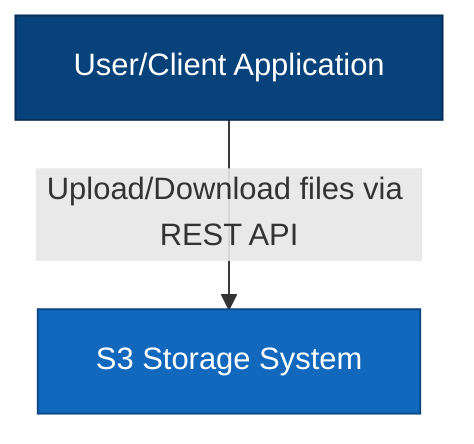
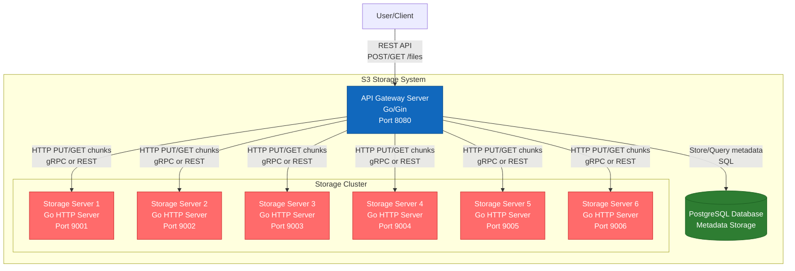
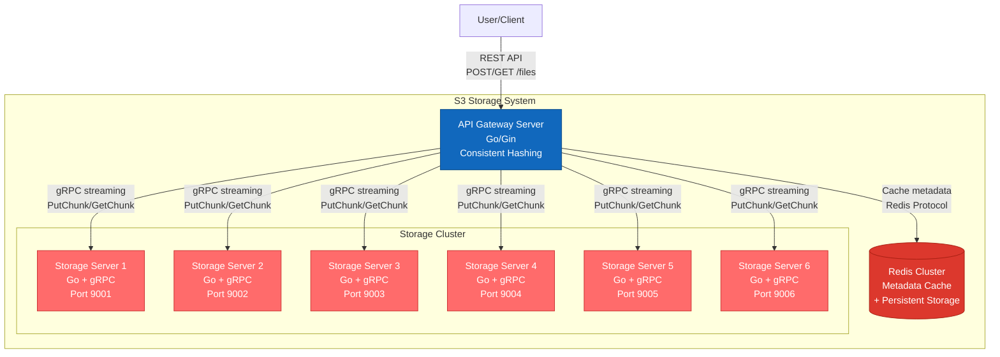
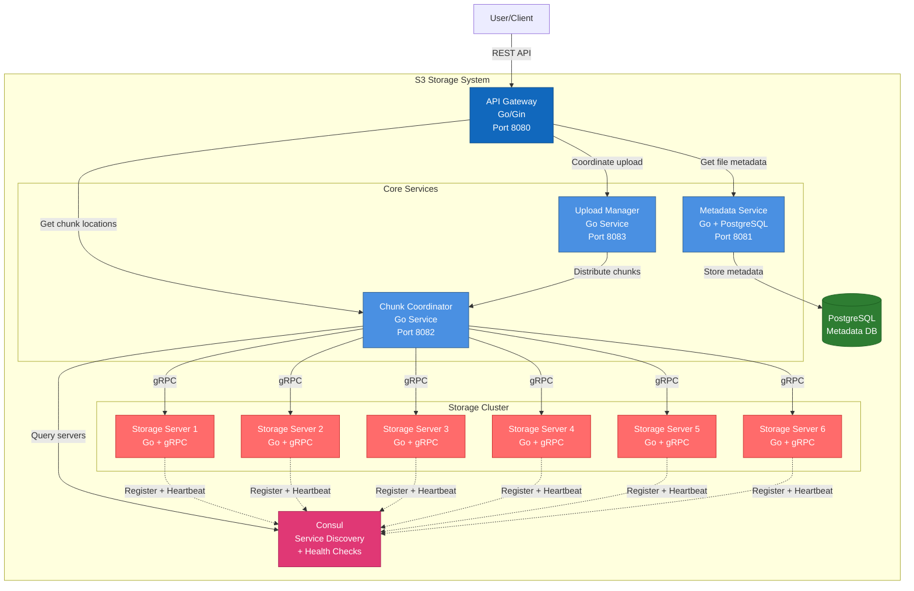

# Architectural Variants of Distributed File Storage System

## Introduction

This document describes three architectural variants of a distributed file storage system (S3-like service) using C4 Model (Context and Container levels).

**Key Requirements:**
- REST API server for file upload/download
- Split files into 6 equal parts
- Storage on separate servers (minimum 6)
- Files up to 10 GiB
- Dynamic addition of storage servers
- Uniform load distribution
- Interrupted upload handling
- Strong consistency, single-copy storage (MVP)

---

## Variant 1: Centralized Architecture with PostgreSQL

### C4 Level 1: System Context Diagram



**Description:** User interacts with the storage system through REST API for uploading and downloading files.

### C4 Level 2: Container Diagram



### Components

1. **API Gateway Server (Go)**
   - REST API endpoints: `POST /files`, `GET /files/{id}`
   - Chunking logic: splitting file into 6 parts
   - Upload/download coordination
   - Metadata management through PostgreSQL
   - Round-robin chunk distribution

2. **PostgreSQL Database**
   - File metadata storage
   - Tables:
     - `files`: file_id, name, size, upload_status, created_at
     - `chunks`: chunk_id, file_id, chunk_number, storage_server_id, size
     - `storage_servers`: server_id, host, port, available_space, status

3. **Storage Servers (Go)**
   - HTTP/gRPC server for receiving chunks
   - Endpoints: `PUT /chunks/{id}`, `GET /chunks/{id}`, `DELETE /chunks/{id}`
   - Local disk storage
   - Health check endpoint

### Pros

✅ **Implementation simplicity**: Centralized logic in API Gateway
✅ **Metadata reliability**: PostgreSQL provides ACID transactions
✅ **Easy debugging**: All metadata in one place
✅ **Consistency**: Strong consistency out of the box
✅ **Storage scalability**: Easy to add new storage servers
✅ **Rollback support**: Can rollback failed uploads through transactions

### Cons

❌ **Single Point of Failure**: PostgreSQL is a bottleneck
❌ **API Gateway scalability**: Single server handles all requests
❌ **DB performance**: May have issues with large number of files
❌ **Network load**: All data passes through API Gateway
❌ **Latency**: Additional DB queries on each operation

---

## Variant 2: Distributed Architecture with Redis and Consistent Hashing

### C4 Level 1: System Context Diagram


### C4 Level 2: Container Diagram



### Components

1. **API Gateway Server (Go)**
   - REST API with chunking logic
   - **Consistent Hashing** for chunk distribution
   - gRPC client for storage communication
   - Streaming upload/download for large files

2. **Redis Cluster**
   - In-memory metadata cache
   - Persistence (AOF/RDB) for reliability
   - Data structures:
     - Hash: `file:{id}` → metadata
     - Set: `chunks:{file_id}` → chunk locations
     - Sorted Set: `servers` → server load balancing

3. **Storage Servers (Go + gRPC)**
   - gRPC server with streaming support
   - Methods: `PutChunk(stream)`, `GetChunk(stream)`, `DeleteChunk`
   - Local chunk storage
   - Heartbeat to Redis for health monitoring

### Pros

✅ **High performance**: Redis provides fast metadata access
✅ **Consistent Hashing**: Uniform distribution and easy server addition
✅ **gRPC Streaming**: Efficient large file transfer
✅ **Scalability**: Redis Cluster can scale horizontally
✅ **Low latency**: In-memory operations
✅ **Simple server addition**: Consistent hashing minimizes redistribution

### Cons

❌ **Complexity**: Consistent hashing requires careful implementation
❌ **Redis persistence**: Risk of data loss on failure (even with AOF)
❌ **Memory**: Redis requires sufficient RAM for metadata
❌ **Single API Gateway**: Still a bottleneck
❌ **Debugging**: Harder to track chunk distribution

---

## Variant 3: Microservices Architecture with Service Discovery

### C4 Level 1: System Context Diagram


### C4 Level 2: Container Diagram



### Components

1. **API Gateway (Go)**
   - REST API facade
   - Request routing to microservices
   - Authentication/authorization

2. **Metadata Service (Go + PostgreSQL)**
   - File metadata management
   - CRUD operations for files
   - Transactional consistency

3. **Chunk Coordinator (Go)**
   - Chunk distribution logic
   - Storage server selection through Consul
   - Load balancing algorithms
   - Server availability monitoring

4. **Upload Manager (Go)**
   - Upload process management
   - Interrupted upload handling
   - Retry logic
   - Failed upload cleanup

5. **Consul**
   - Service Discovery for storage servers
   - Health checking
   - Key-Value store for configuration
   - Dynamic registration of new servers

6. **Storage Servers (Go + gRPC)**
   - Self-registration in Consul
   - gRPC API for chunks
   - Health check endpoint

### Pros

✅ **Separation of concerns**: Each service solves its own task
✅ **Scalability**: Can scale each service independently
✅ **Service Discovery**: Automatic storage server discovery
✅ **Fault tolerance**: Health checks and automatic exclusion of failed servers
✅ **Flexibility**: Easy to add new services and functionality
✅ **Monitoring**: Consul provides built-in monitoring
✅ **Independent deployment**: Services can be updated separately

### Cons

❌ **Complexity**: Most complex architecture of the three
❌ **Operational overhead**: More components to manage
❌ **Network latency**: More network calls between services
❌ **Debugging**: Harder to track requests through multiple services
❌ **Infrastructure**: Requires more resources
❌ **Development time**: Takes longer to implement

---

## Comparison Table

| Criterion | Variant 1: PostgreSQL | Variant 2: Redis + CH | Variant 3: Microservices |
|----------|----------------------|----------------------|------------------------|
| **Implementation Complexity** | ⭐⭐ Low | ⭐⭐⭐ Medium | ⭐⭐⭐⭐⭐ High |
| **Performance** | ⭐⭐⭐ Medium | ⭐⭐⭐⭐⭐ High | ⭐⭐⭐⭐ Good |
| **Scalability** | ⭐⭐⭐ Medium | ⭐⭐⭐⭐ Good | ⭐⭐⭐⭐⭐ Excellent |
| **Metadata Reliability** | ⭐⭐⭐⭐⭐ Excellent | ⭐⭐⭐ Medium | ⭐⭐⭐⭐⭐ Excellent |
| **Fault Tolerance** | ⭐⭐ Low | ⭐⭐⭐ Medium | ⭐⭐⭐⭐⭐ Excellent |
| **Operational Complexity** | ⭐⭐ Low | ⭐⭐⭐ Medium | ⭐⭐⭐⭐⭐ High |
| **Development Time** | 2-3 weeks | 3-4 weeks | 5-6 weeks |
| **Suitable for MVP** | ✅ Yes | ✅ Yes | ❌ No |
| **Production-ready** | ⚠️ With limitations | ✅ Yes | ✅ Yes |

---

## Recommendations

### For MVP and Quick Start
**Recommended: Variant 1 (PostgreSQL)**

Reasons:
- Simple and clear architecture
- Fast development
- Reliable metadata storage
- Easy debugging
- Meets strong consistency requirement

### For Production with High Load
**Recommended: Variant 2 (Redis + Consistent Hashing)**

Reasons:
- High performance
- Good scalability
- Efficient load distribution
- Reasonable balance of complexity and capabilities

### For Enterprise Solution
**Recommended: Variant 3 (Microservices)**

Reasons:
- Maximum flexibility
- Excellent scalability
- High fault tolerance
- Ability for independent component evolution

---

## Common Technical Solutions for All Variants

### Storage Server Communication Protocol
**Recommendation: gRPC with streaming**

Advantages:
- Binary protocol (more efficient than REST)
- Streaming for large files
- Built-in support in Go
- Type-safe contracts through protobuf

### Interrupted Upload Handling
1. **Multipart upload**: Split into chunks with resume capability
2. **Upload ID**: Unique identifier for each upload
3. **Timeout mechanism**: Automatic cleanup of incomplete uploads
4. **Idempotency**: Ability to resend chunks

### Uniform Distribution
1. **Round-robin** (Variant 1)
2. **Consistent hashing** (Variant 2)
3. **Load-based selection** (Variant 3)

### Docker Compose Structure
```yaml
services:
  api-gateway:
    # API server
  
  metadata-db:
    # PostgreSQL or Redis
  
  storage-1..N:
    # Storage servers
  
  consul: # only for variant 3
    # Service discovery
```

---

## Next Steps

1. Choose architectural variant
2. Detail API specification
3. Define data structure
4. Design DB/cache schema
5. Develop protobuf schemas for gRPC
6. Create docker-compose configuration
7. Implement basic prototype