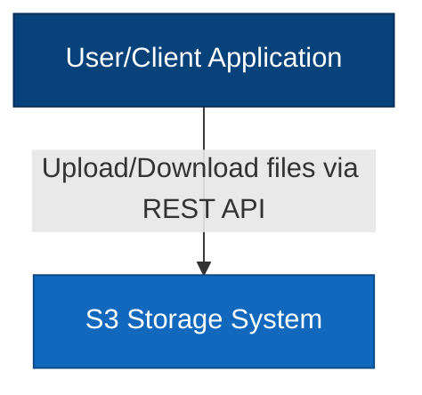
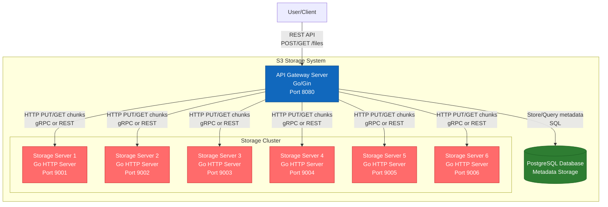
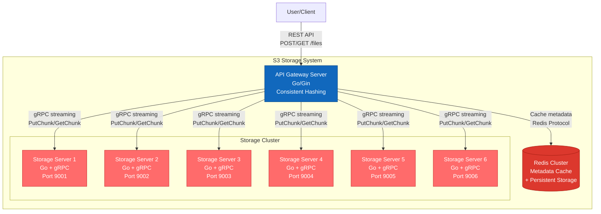
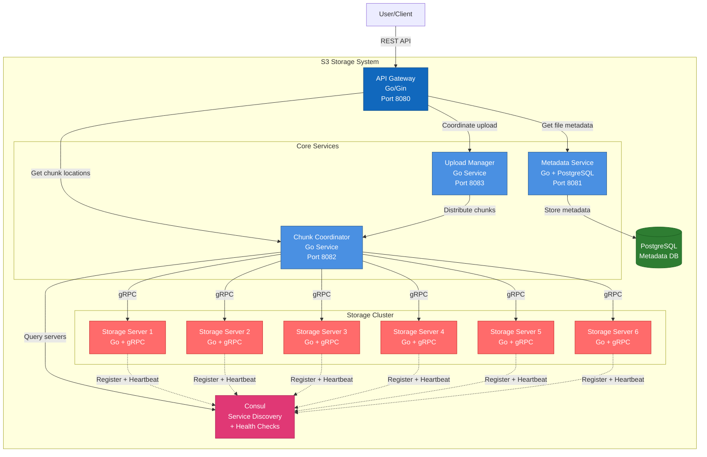

# Архитектурные варианты системы распределенного хранения файлов

## Введение

Данный документ описывает три архитектурных варианта системы распределенного хранения файлов (S3-подобный сервис) с использованием C4 Model (Context и Container уровни).

**Ключевые требования:**
- REST API сервер для загрузки/скачивания файлов
- Разделение файлов на 6 равных частей
- Хранение на отдельных серверах (минимум 6)
- Файлы до 10 GiB
- Динамическое добавление storage серверов
- Равномерное распределение нагрузки
- Обработка прерванных загрузок
- Strong consistency, single-copy storage (MVP)

---

## Вариант 1: Централизованная архитектура с PostgreSQL

### C4 Level 1: System Context Diagram



**Описание:** Пользователь взаимодействует с системой хранения через REST API для загрузки и скачивания файлов.

### C4 Level 2: Container Diagram



### Компоненты

1. **API Gateway Server (Go)**
   - REST API endpoints: `POST /files`, `GET /files/{id}`
   - Chunking logic: разделение файла на 6 частей
   - Координация загрузки/скачивания
   - Управление метаданными через PostgreSQL
   - Round-robin распределение chunks

2. **PostgreSQL Database**
   - Хранение метаданных файлов
   - Таблицы:
     - `files`: file_id, name, size, upload_status, created_at
     - `chunks`: chunk_id, file_id, chunk_number, storage_server_id, size
     - `storage_servers`: server_id, host, port, available_space, status

3. **Storage Servers (Go)**
   - HTTP/gRPC сервер для приема chunks
   - Endpoints: `PUT /chunks/{id}`, `GET /chunks/{id}`, `DELETE /chunks/{id}`
   - Локальное хранение на диске
   - Health check endpoint

### Плюсы

✅ **Простота реализации**: Централизованная логика в API Gateway  
✅ **Надежность метаданных**: PostgreSQL обеспечивает ACID транзакции  
✅ **Легкая отладка**: Все метаданные в одном месте  
✅ **Консистентность**: Strong consistency из коробки  
✅ **Масштабируемость storage**: Легко добавлять новые storage серверы  
✅ **Rollback поддержка**: Можно откатить неудачные загрузки через транзакции  

### Минусы

❌ **Single Point of Failure**: PostgreSQL - узкое место  
❌ **Масштабируемость API Gateway**: Один сервер обрабатывает все запросы  
❌ **Производительность БД**: При большом количестве файлов могут быть проблемы  
❌ **Сетевая нагрузка**: Все данные проходят через API Gateway  
❌ **Latency**: Дополнительные запросы к БД на каждую операцию  

---

## Вариант 2: Распределенная архитектура с Redis и Consistent Hashing

### C4 Level 1: System Context Diagram


### C4 Level 2: Container Diagram



### Компоненты

1. **API Gateway Server (Go)**
   - REST API с chunking logic
   - **Consistent Hashing** для распределения chunks
   - gRPC клиент для общения со storage
   - Streaming upload/download для больших файлов

2. **Redis Cluster**
   - In-memory кеш метаданных
   - Persistence (AOF/RDB) для надежности
   - Структуры данных:
     - Hash: `file:{id}` → metadata
     - Set: `chunks:{file_id}` → chunk locations
     - Sorted Set: `servers` → server load balancing

3. **Storage Servers (Go + gRPC)**
   - gRPC сервер с streaming support
   - Methods: `PutChunk(stream)`, `GetChunk(stream)`, `DeleteChunk`
   - Локальное хранение chunks
   - Heartbeat в Redis для health monitoring

### Плюсы

✅ **Высокая производительность**: Redis обеспечивает быстрый доступ к метаданным  
✅ **Consistent Hashing**: Равномерное распределение и легкое добавление серверов  
✅ **gRPC Streaming**: Эффективная передача больших файлов  
✅ **Масштабируемость**: Redis Cluster может горизонтально масштабироваться  
✅ **Низкая latency**: In-memory операции  
✅ **Простое добавление серверов**: Consistent hashing минимизирует перераспределение  

### Минусы

❌ **Сложность**: Consistent hashing требует тщательной реализации  
❌ **Redis persistence**: Риск потери данных при сбое (даже с AOF)  
❌ **Память**: Redis требует достаточно RAM для метаданных  
❌ **Single API Gateway**: Все еще узкое место  
❌ **Отладка**: Сложнее отследить распределение chunks  

---

## Вариант 3: Микросервисная архитектура с Service Discovery

### C4 Level 1: System Context Diagram


### C4 Level 2: Container Diagram



### Компоненты

1. **API Gateway (Go)**
   - REST API фасад
   - Маршрутизация запросов к микросервисам
   - Аутентификация/авторизация

2. **Metadata Service (Go + PostgreSQL)**
   - Управление метаданными файлов
   - CRUD операции для файлов
   - Транзакционная консистентность

3. **Chunk Coordinator (Go)**
   - Логика распределения chunks
   - Выбор storage серверов через Consul
   - Load balancing алгоритмы
   - Мониторинг доступности серверов

4. **Upload Manager (Go)**
   - Управление процессом загрузки
   - Обработка прерванных загрузок
   - Retry logic
   - Cleanup неудачных загрузок

5. **Consul**
   - Service Discovery для storage серверов
   - Health checking
   - Key-Value store для конфигурации
   - Динамическая регистрация новых серверов

6. **Storage Servers (Go + gRPC)**
   - Самостоятельная регистрация в Consul
   - gRPC API для chunks
   - Health check endpoint

### Плюсы

✅ **Разделение ответственности**: Каждый сервис решает свою задачу  
✅ **Масштабируемость**: Можно масштабировать каждый сервис независимо  
✅ **Service Discovery**: Автоматическое обнаружение storage серверов  
✅ **Отказоустойчивость**: Health checks и автоматическое исключение неработающих серверов  
✅ **Гибкость**: Легко добавлять новые сервисы и функциональность  
✅ **Мониторинг**: Consul предоставляет встроенный мониторинг  
✅ **Независимое развертывание**: Сервисы можно обновлять отдельно  

### Минусы

❌ **Сложность**: Самая сложная архитектура из трех  
❌ **Operational overhead**: Больше компонентов для управления  
❌ **Network latency**: Больше сетевых вызовов между сервисами  
❌ **Debugging**: Сложнее отслеживать запросы через несколько сервисов  
❌ **Инфраструктура**: Требует больше ресурсов  
❌ **Время разработки**: Дольше реализовывать  

---

## Сравнительная таблица

| Критерий | Вариант 1: PostgreSQL | Вариант 2: Redis + CH | Вариант 3: Микросервисы |
|----------|----------------------|----------------------|------------------------|
| **Сложность реализации** | ⭐⭐ Низкая | ⭐⭐⭐ Средняя | ⭐⭐⭐⭐⭐ Высокая |
| **Производительность** | ⭐⭐⭐ Средняя | ⭐⭐⭐⭐⭐ Высокая | ⭐⭐⭐⭐ Хорошая |
| **Масштабируемость** | ⭐⭐⭐ Средняя | ⭐⭐⭐⭐ Хорошая | ⭐⭐⭐⭐⭐ Отличная |
| **Надежность метаданных** | ⭐⭐⭐⭐⭐ Отличная | ⭐⭐⭐ Средняя | ⭐⭐⭐⭐⭐ Отличная |
| **Отказоустойчивость** | ⭐⭐ Низкая | ⭐⭐⭐ Средняя | ⭐⭐⭐⭐⭐ Отличная |
| **Operational сложность** | ⭐⭐ Низкая | ⭐⭐⭐ Средняя | ⭐⭐⭐⭐⭐ Высокая |
| **Время разработки** | 2-3 недели | 3-4 недели | 5-6 недель |
| **Подходит для MVP** | ✅ Да | ✅ Да | ❌ Нет |
| **Production-ready** | ⚠️ С ограничениями | ✅ Да | ✅ Да |

---

## Рекомендации

### Для MVP и быстрого старта
**Рекомендуется: Вариант 1 (PostgreSQL)**

Причины:
- Простая и понятная архитектура
- Быстрая разработка
- Надежное хранение метаданных
- Легкая отладка
- Соответствует требованию strong consistency

### Для production с высокой нагрузкой
**Рекомендуется: Вариант 2 (Redis + Consistent Hashing)**

Причины:
- Высокая производительность
- Хорошая масштабируемость
- Эффективное распределение нагрузки
- Разумный баланс сложности и возможностей

### Для enterprise решения
**Рекомендуется: Вариант 3 (Микросервисы)**

Причины:
- Максимальная гибкость
- Отличная масштабируемость
- Высокая отказоустойчивость
- Возможность независимого развития компонентов

---

## Общие технические решения для всех вариантов

### Протокол общения с Storage серверами
**Рекомендация: gRPC с streaming**

Преимущества:
- Бинарный протокол (эффективнее REST)
- Streaming для больших файлов
- Встроенная поддержка в Go
- Type-safe контракты через protobuf

### Обработка прерванных загрузок
1. **Multipart upload**: Разделение на chunks с возможностью resume
2. **Upload ID**: Уникальный идентификатор для каждой загрузки
3. **Timeout механизм**: Автоматическая очистка незавершенных загрузок
4. **Idempotency**: Возможность повторной отправки chunks

### Равномерное распределение
1. **Round-robin** (Вариант 1)
2. **Consistent hashing** (Вариант 2)
3. **Load-based selection** (Вариант 3)

### Docker Compose структура
```yaml
services:
  api-gateway:
    # API сервер
  
  metadata-db:
    # PostgreSQL или Redis
  
  storage-1..N:
    # Storage серверы
  
  consul: # только для варианта 3
    # Service discovery
```

---

## Следующие шаги

1. Выбрать архитектурный вариант
2. Детализировать API спецификацию
3. Определить структуру данных
4. Спроектировать схему БД/кеша
5. Разработать protobuf схемы для gRPC
6. Создать docker-compose конфигурацию
7. Реализовать базовый прототип