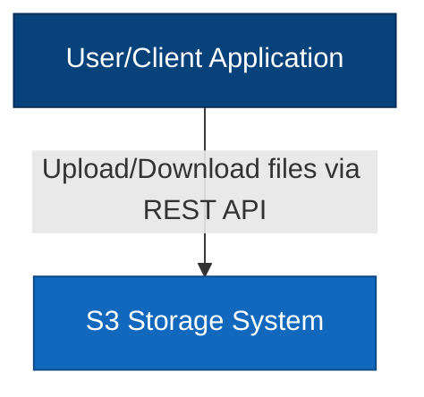
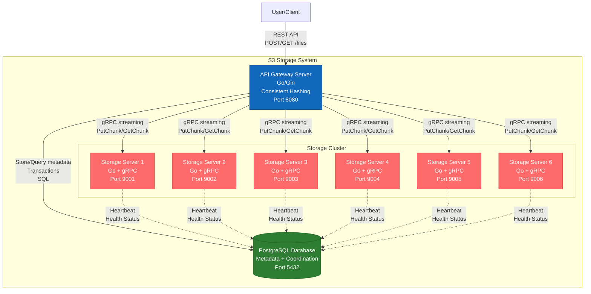
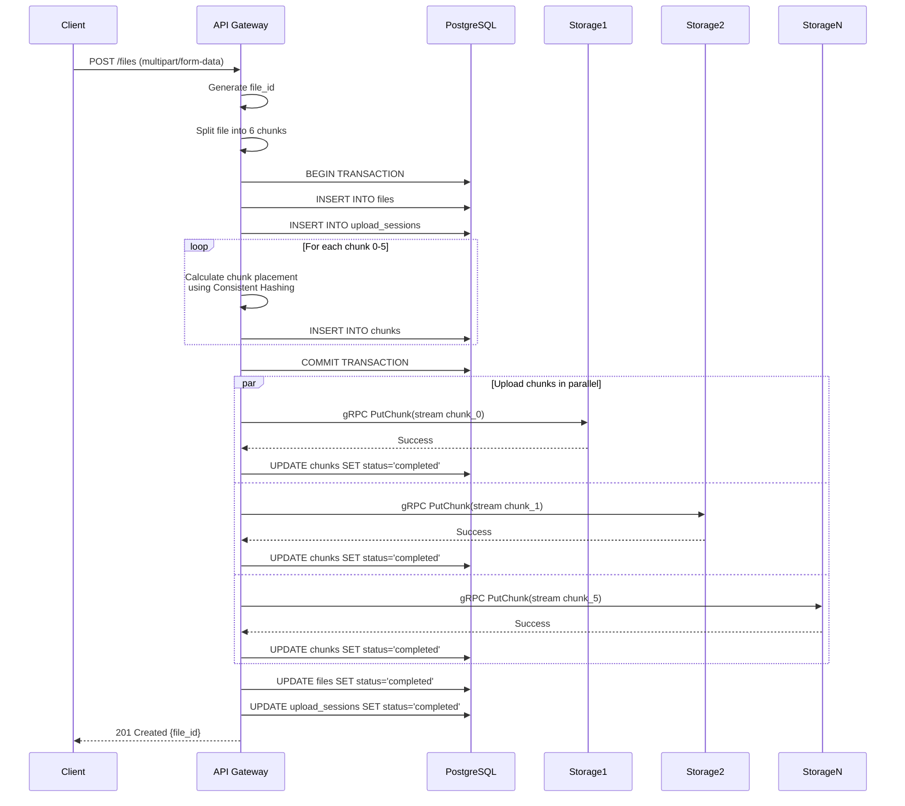
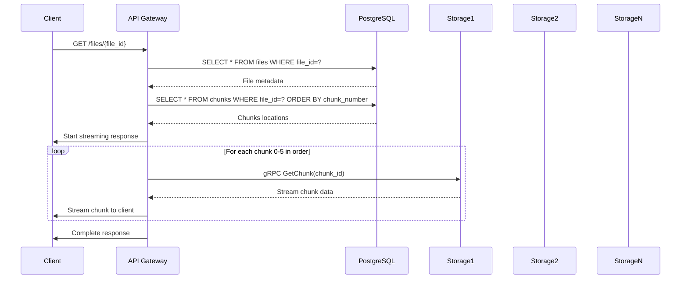
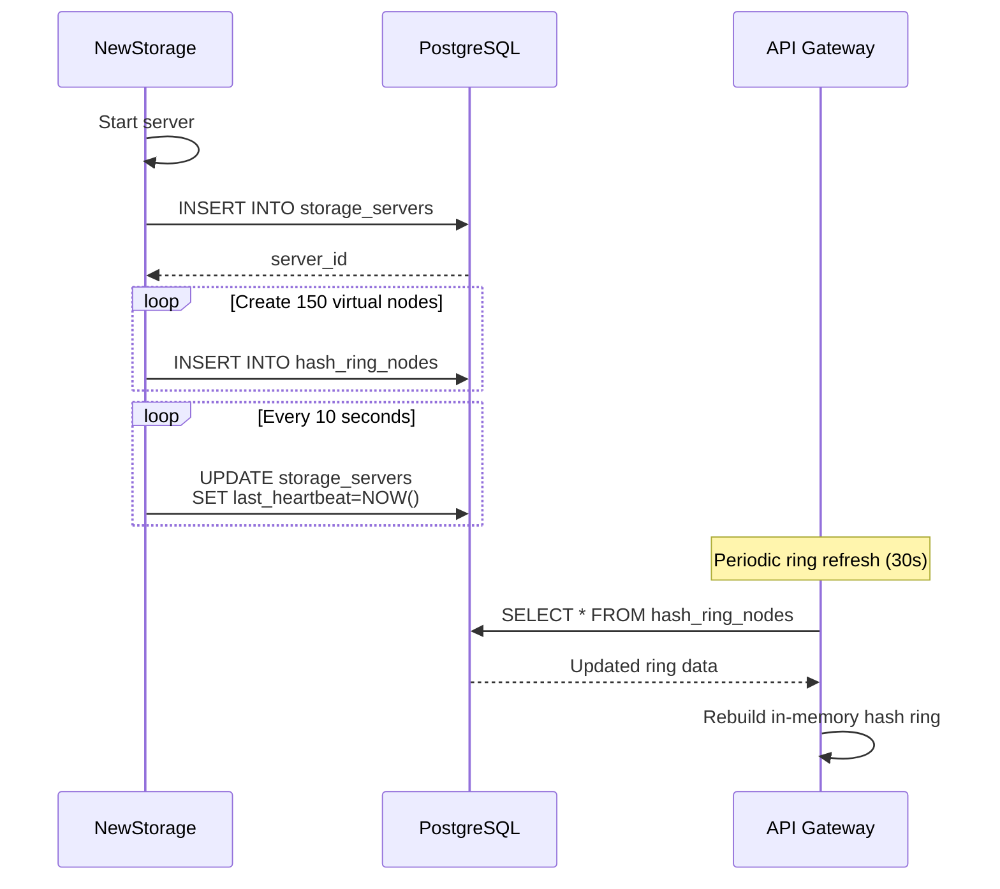
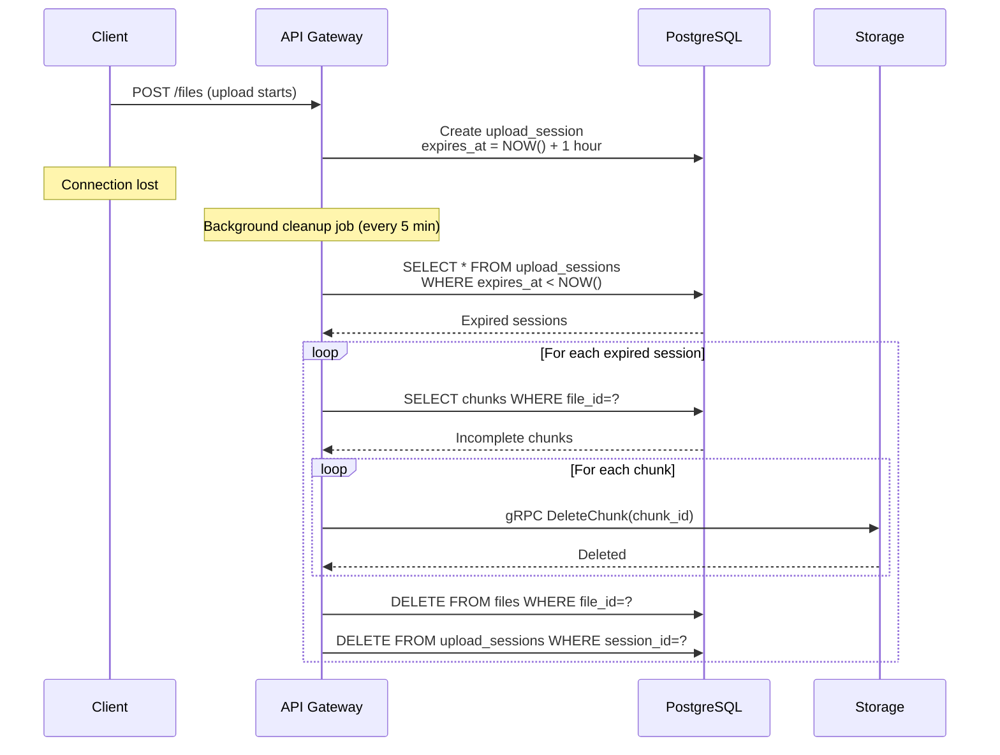

# Вариант 2: Распределенная архитектура с PostgreSQL и Consistent Hashing

## Обзор

Данный вариант представляет собой адаптацию Варианта 2 (распределенная архитектура с Consistent Hashing), где вместо Redis используется PostgreSQL для хранения метаданных. Это решение сочетает преимущества распределенной архитектуры с надежностью реляционной базы данных.

## C4 Level 1: System Context Diagram



**Описание:** Пользователь взаимодействует с системой хранения через REST API для загрузки и скачивания файлов размером до 10 GiB.

## C4 Level 2: Container Diagram



## Архитектурные компоненты

### 1. API Gateway Server (Go)

**Технологии:** Go 1.21+, Gin Framework, gRPC client

**Ответственность:**
- REST API endpoints: `POST /files`, `GET /files/{id}`, `DELETE /files/{id}`
- Chunking logic: разделение файла на 6 равных частей
- **Consistent Hashing** для детерминированного распределения chunks
- Streaming upload/download для файлов до 10 GiB
- Координация с PostgreSQL для метаданных
- Retry logic при сбоях storage серверов
- Обработка прерванных загрузок

**Ключевые особенности:**
- In-memory кеширование consistent hash ring для производительности
- Connection pooling к PostgreSQL
- gRPC connection pool к storage серверам
- Graceful shutdown с завершением активных загрузок

### 2. PostgreSQL Database

**Версия:** PostgreSQL 15+

**Ответственность:**
- Хранение метаданных файлов
- Координация состояния storage серверов
- Управление незавершенными загрузками
- ACID транзакции для консистентности

**Схема базы данных:**

```sql
-- Таблица файлов
CREATE TABLE files (
    file_id UUID PRIMARY KEY DEFAULT gen_random_uuid(),
    filename VARCHAR(255) NOT NULL,
    content_type VARCHAR(100),
    total_size BIGINT NOT NULL,
    chunk_size BIGINT NOT NULL,
    num_chunks INTEGER NOT NULL CHECK (num_chunks = 6),
    upload_status VARCHAR(20) NOT NULL DEFAULT 'pending',
    -- pending, uploading, completed, failed
    created_at TIMESTAMP WITH TIME ZONE DEFAULT NOW(),
    updated_at TIMESTAMP WITH TIME ZONE DEFAULT NOW(),
    completed_at TIMESTAMP WITH TIME ZONE,
    checksum VARCHAR(64), -- SHA-256 hash
    metadata JSONB -- дополнительные метаданные
);

CREATE INDEX idx_files_status ON files(upload_status);
CREATE INDEX idx_files_created ON files(created_at DESC);

-- Таблица chunks
CREATE TABLE chunks (
    chunk_id UUID PRIMARY KEY DEFAULT gen_random_uuid(),
    file_id UUID NOT NULL REFERENCES files(file_id) ON DELETE CASCADE,
    chunk_number INTEGER NOT NULL CHECK (chunk_number >= 0 AND chunk_number < 6),
    storage_server_id UUID NOT NULL,
    chunk_size BIGINT NOT NULL,
    chunk_hash VARCHAR(64), -- SHA-256 hash chunk
    upload_status VARCHAR(20) NOT NULL DEFAULT 'pending',
    created_at TIMESTAMP WITH TIME ZONE DEFAULT NOW(),
    uploaded_at TIMESTAMP WITH TIME ZONE,
    UNIQUE(file_id, chunk_number)
);

CREATE INDEX idx_chunks_file ON chunks(file_id);
CREATE INDEX idx_chunks_server ON chunks(storage_server_id);
CREATE INDEX idx_chunks_status ON chunks(upload_status);

-- Таблица storage серверов
CREATE TABLE storage_servers (
    server_id UUID PRIMARY KEY DEFAULT gen_random_uuid(),
    host VARCHAR(255) NOT NULL,
    port INTEGER NOT NULL,
    grpc_address VARCHAR(255) NOT NULL UNIQUE,
    status VARCHAR(20) NOT NULL DEFAULT 'active',
    -- active, inactive, maintenance
    available_space BIGINT,
    used_space BIGINT DEFAULT 0,
    total_chunks INTEGER DEFAULT 0,
    last_heartbeat TIMESTAMP WITH TIME ZONE,
    registered_at TIMESTAMP WITH TIME ZONE DEFAULT NOW(),
    metadata JSONB,
    UNIQUE(host, port)
);

CREATE INDEX idx_servers_status ON storage_servers(status);
CREATE INDEX idx_servers_heartbeat ON storage_servers(last_heartbeat DESC);

-- Таблица для consistent hash ring (виртуальные узлы)
CREATE TABLE hash_ring_nodes (
    node_id UUID PRIMARY KEY DEFAULT gen_random_uuid(),
    server_id UUID NOT NULL REFERENCES storage_servers(server_id) ON DELETE CASCADE,
    virtual_node_index INTEGER NOT NULL,
    hash_value BIGINT NOT NULL,
    created_at TIMESTAMP WITH TIME ZONE DEFAULT NOW(),
    UNIQUE(server_id, virtual_node_index)
);

CREATE INDEX idx_hash_ring_value ON hash_ring_nodes(hash_value);

-- Таблица для отслеживания незавершенных загрузок
CREATE TABLE upload_sessions (
    session_id UUID PRIMARY KEY DEFAULT gen_random_uuid(),
    file_id UUID NOT NULL REFERENCES files(file_id) ON DELETE CASCADE,
    client_ip VARCHAR(45),
    started_at TIMESTAMP WITH TIME ZONE DEFAULT NOW(),
    last_activity TIMESTAMP WITH TIME ZONE DEFAULT NOW(),
    expires_at TIMESTAMP WITH TIME ZONE,
    status VARCHAR(20) NOT NULL DEFAULT 'active'
    -- active, completed, expired, cancelled
);

CREATE INDEX idx_upload_sessions_file ON upload_sessions(file_id);
CREATE INDEX idx_upload_sessions_expires ON upload_sessions(expires_at);
```

**Оптимизации:**
- Партиционирование таблицы `chunks` по `file_id` для больших объемов
- Материализованные представления для статистики
- Connection pooling (pgBouncer опционально)
- Регулярная очистка старых незавершенных загрузок

### 3. Storage Servers (Go + gRPC)

**Технологии:** Go 1.21+, gRPC, Protocol Buffers

**Ответственность:**
- gRPC сервер с streaming support
- Локальное хранение chunks на диске
- Heartbeat в PostgreSQL для health monitoring
- Самостоятельная регистрация при старте
- Управление дисковым пространством

**gRPC API (protobuf):**

```protobuf
syntax = "proto3";

package storage;

service StorageService {
    // Загрузка chunk с streaming
    rpc PutChunk(stream ChunkData) returns (PutChunkResponse);
    
    // Скачивание chunk с streaming
    rpc GetChunk(GetChunkRequest) returns (stream ChunkData);
    
    // Удаление chunk
    rpc DeleteChunk(DeleteChunkRequest) returns (DeleteChunkResponse);
    
    // Health check
    rpc HealthCheck(HealthCheckRequest) returns (HealthCheckResponse);
    
    // Получение статистики сервера
    rpc GetStats(GetStatsRequest) returns (GetStatsResponse);
}

message ChunkData {
    string chunk_id = 1;
    bytes data = 2;
    int64 offset = 3;
    int64 total_size = 4;
}

message PutChunkResponse {
    bool success = 1;
    string chunk_id = 2;
    string error_message = 3;
}

message GetChunkRequest {
    string chunk_id = 1;
}

message DeleteChunkRequest {
    string chunk_id = 1;
}

message DeleteChunkResponse {
    bool success = 1;
    string error_message = 2;
}

message HealthCheckRequest {}

message HealthCheckResponse {
    bool healthy = 1;
    int64 available_space = 2;
    int64 used_space = 3;
    int32 chunk_count = 4;
}

message GetStatsRequest {}

message GetStatsResponse {
    int64 total_space = 1;
    int64 used_space = 2;
    int64 available_space = 3;
    int32 total_chunks = 4;
}
```

**Хранение на диске:**
- Структура: `/data/chunks/{chunk_id}`
- Atomic writes с временными файлами
- Периодическая проверка целостности
- Cleanup orphaned chunks

## Consistent Hashing Implementation

### Алгоритм

**Consistent Hashing** используется для детерминированного распределения chunks по storage серверам с минимальным перераспределением при добавлении новых серверов.

**Ключевые параметры:**
- Количество виртуальных узлов на сервер: 150
- Hash функция: xxHash (быстрая и качественная)
- Ring size: 2^32 (uint32)

**Процесс распределения:**

1. **Инициализация ring:**
   ```
   Для каждого storage сервера:
     Для i от 0 до 149:
       virtual_key = server_id + "#" + i
       hash_value = xxHash(virtual_key)
       Добавить (hash_value, server_id) в ring
   Сортировать ring по hash_value
   ```

2. **Размещение chunk:**
   ```
   chunk_key = file_id + "#" + chunk_number
   chunk_hash = xxHash(chunk_key)
   
   Найти первый узел в ring где hash_value >= chunk_hash
   Если не найден, взять первый узел в ring
   Вернуть server_id этого узла
   ```

3. **Добавление нового сервера:**
   ```
   Создать 150 виртуальных узлов для нового сервера
   Вставить их в ring с сохранением сортировки
   Обновить кеш в API Gateway
   ```

**Преимущества:**
- Детерминированное распределение (один и тот же chunk всегда на одном сервере)
- Минимальное перераспределение при добавлении серверов (~1/N chunks)
- Равномерное распределение благодаря виртуальным узлам
- Быстрый поиск O(log N)

### Кеширование Ring в API Gateway

API Gateway кеширует hash ring в памяти для производительности:

```go
type HashRing struct {
    nodes []HashNode
    servers map[string]*StorageServer
    mu sync.RWMutex
    lastUpdate time.Time
}

type HashNode struct {
    HashValue uint32
    ServerID string
}
```

**Обновление кеша:**
- При старте API Gateway
- Периодически каждые 30 секунд
- При получении уведомления о новом сервере
- При обнаружении недоступного сервера

## Workflow диаграммы

### Upload File Flow



### Download File Flow



### Add New Storage Server Flow



### Handle Interrupted Upload Flow



## Преимущества варианта с PostgreSQL

### ✅ Надежность и консистентность
- **ACID транзакции**: Гарантированная консистентность метаданных
- **Durability**: Данные не теряются при сбоях (в отличие от Redis)
- **Strong consistency**: Соответствует требованиям MVP
- **Referential integrity**: Foreign keys обеспечивают целостность данных

### ✅ Производительность
- **Consistent Hashing**: Быстрое O(log N) определение storage сервера
- **In-memory кеш ring**: Минимальные обращения к БД для размещения
- **Connection pooling**: Эффективное использование соединений
- **Индексы**: Быстрые запросы по всем критическим полям
- **gRPC streaming**: Эффективная передача больших файлов

### ✅ Масштабируемость
- **Динамическое добавление серверов**: Consistent hashing минимизирует перераспределение
- **Равномерное распределение**: Виртуальные узлы обеспечивают баланс
- **Партиционирование**: PostgreSQL поддерживает партиционирование таблиц
- **Read replicas**: Можно добавить для масштабирования чтения

### ✅ Операционные преимущества
- **Простота backup**: Стандартные инструменты PostgreSQL
- **Мониторинг**: Богатая экосистема инструментов
- **Debugging**: SQL запросы легко отлаживать
- **Миграции**: Управление схемой через migrations
- **Аудит**: Легко добавить audit log

### ✅ Функциональность
- **Сложные запросы**: SQL позволяет делать аналитику
- **JSONB**: Гибкое хранение дополнительных метаданных
- **Triggers**: Автоматизация бизнес-логики
- **Full-text search**: Поиск по файлам (опционально)

## Недостатки и митигация

### ⚠️ Latency БД запросов
**Проблема:** PostgreSQL медленнее Redis для простых операций

**Митигация:**
- In-memory кеш hash ring в API Gateway
- Connection pooling для минимизации overhead
- Batch операции где возможно
- Prepared statements для часто используемых запросов
- Индексы на всех критических полях

### ⚠️ Single Point of Failure
**Проблема:** PostgreSQL - единственная точка отказа

**Митигация:**
- PostgreSQL replication (streaming replication)
- Automatic failover с Patroni/Stolon
- Regular backups (pg_dump, WAL archiving)
- Health checks и мониторинг

### ⚠️ Масштабирование записи
**Проблема:** Один master для записи

**Митигация:**
- Оптимизация транзакций (короткие, эффективные)
- Batch inserts для chunks
- Асинхронные операции где возможно
- Партиционирование таблиц при росте

## Сравнение с Redis вариантом

| Критерий | PostgreSQL | Redis |
|----------|-----------|-------|
| **Durability** | ⭐⭐⭐⭐⭐ Отличная | ⭐⭐⭐ Средняя (даже с AOF) |
| **Consistency** | ⭐⭐⭐⭐⭐ ACID | ⭐⭐⭐ Eventual (cluster) |
| **Latency** | ⭐⭐⭐ ~1-5ms | ⭐⭐⭐⭐⭐ <1ms |
| **Сложность запросов** | ⭐⭐⭐⭐⭐ SQL | ⭐⭐ Ограничена |
| **Backup/Recovery** | ⭐⭐⭐⭐⭐ Зрелые инструменты | ⭐⭐⭐ RDB/AOF |
| **Operational сложность** | ⭐⭐⭐ Средняя | ⭐⭐⭐ Средняя |
| **Память** | ⭐⭐⭐⭐ Эффективная | ⭐⭐ Требует много RAM |
| **Масштабирование** | ⭐⭐⭐ Вертикальное + replicas | ⭐⭐⭐⭐ Горизонтальное (cluster) |

## Технический стек

### API Gateway
- **Язык:** Go 1.21+
- **Framework:** Gin (REST API)
- **gRPC:** google.golang.org/grpc
- **PostgreSQL driver:** pgx v5
- **Hashing:** github.com/cespare/xxhash
- **Logging:** zerolog
- **Metrics:** Prometheus client

### Storage Server
- **Язык:** Go 1.21+
- **gRPC:** google.golang.org/grpc
- **PostgreSQL driver:** pgx v5 (для heartbeat)
- **File I/O:** os package с atomic writes
- **Logging:** zerolog

### Database
- **PostgreSQL:** 15+
- **Connection pooling:** pgBouncer (опционально)
- **Monitoring:** pg_stat_statements, pgAdmin

### Infrastructure
- **Containerization:** Docker
- **Orchestration:** Docker Compose
- **Networking:** Docker bridge network

## Конфигурация

### API Gateway (config.yaml)
```yaml
server:
  port: 8080
  read_timeout: 300s
  write_timeout: 300s
  max_upload_size: 10737418240 # 10 GiB

database:
  host: postgres
  port: 5432
  database: s3storage
  user: s3user
  password: s3password
  max_connections: 50
  max_idle_connections: 10

consistent_hashing:
  virtual_nodes_per_server: 150
  ring_refresh_interval: 30s

upload:
  chunk_size: 1789569706 # ~1.67 GiB (10 GiB / 6)
  session_timeout: 3600s # 1 hour
  cleanup_interval: 300s # 5 minutes

storage:
  grpc_timeout: 60s
  max_retries: 3
  retry_delay: 1s
```

### Storage Server (config.yaml)
```yaml
server:
  grpc_port: 9001
  data_dir: /data/chunks

database:
  host: postgres
  port: 5432
  database: s3storage
  user: s3user
  password: s3password

heartbeat:
  interval: 10s
  timeout: 5s

storage:
  max_chunk_size: 2147483648 # 2 GiB
  cleanup_orphaned_interval: 3600s # 1 hour
```

## Мониторинг и метрики

### Ключевые метрики

**API Gateway:**
- Количество активных загрузок/скачиваний
- Latency операций (p50, p95, p99)
- Throughput (bytes/sec)
- Ошибки по типам
- Размер hash ring
- Database connection pool stats

**Storage Servers:**
- Доступное дисковое пространство
- Количество chunks
- gRPC request latency
- Ошибки I/O операций
- Heartbeat status

**PostgreSQL:**
- Connection count
- Query latency
- Transaction rate
- Table sizes
- Index usage
- Replication lag (если есть)

### Health Checks

**API Gateway:**
```
GET /health
Response: {
  "status": "healthy",
  "database": "connected",
  "storage_servers": 6,
  "active_uploads": 3
}
```

**Storage Server:**
```
gRPC HealthCheck()
Response: {
  "healthy": true,
  "available_space": 500000000000,
  "chunk_count": 1234
}
```

## Безопасность

### Аутентификация и авторизация
- API keys для клиентов
- JWT tokens (опционально)
- Rate limiting
- IP whitelisting (опционально)

### Защита данных
- TLS для gRPC соединений
- PostgreSQL SSL connections
- Checksums для chunks (SHA-256)
- File integrity verification

### Сетевая безопасность
- Docker network isolation
- Firewall rules
- Минимальные exposed ports

## Тестирование

### Unit тесты
- Consistent hashing алгоритм
- Chunking logic
- Database operations
- gRPC handlers

### Integration тесты
- End-to-end upload/download
- Прерванные загрузки
- Добавление новых storage серверов
- Failover scenarios

### Load тесты
- Concurrent uploads
- Large file handling (10 GiB)
- Database performance
- Storage server throughput

## Развертывание

### Docker Compose структура
```yaml
version: '3.8'

services:
  postgres:
    image: postgres:15
    volumes:
      - postgres_data:/var/lib/postgresql/data
      - ./migrations:/docker-entrypoint-initdb.d
    environment:
      POSTGRES_DB: s3storage
      POSTGRES_USER: s3user
      POSTGRES_PASSWORD: s3password
    ports:
      - "5432:5432"
    healthcheck:
      test: ["CMD-SHELL", "pg_isready -U s3user"]
      interval: 10s
      timeout: 5s
      retries: 5

  api-gateway:
    build: ./api-gateway
    ports:
      - "8080:8080"
    depends_on:
      postgres:
        condition: service_healthy
    environment:
      DATABASE_HOST: postgres
      DATABASE_PORT: 5432
    volumes:
      - ./config/api-gateway.yaml:/app/config.yaml

  storage-1:
    build: ./storage-server
    ports:
      - "9001:9001"
    depends_on:
      postgres:
        condition: service_healthy
    environment:
      SERVER_ID: storage-1
      GRPC_PORT: 9001
      DATABASE_HOST: postgres
    volumes:
      - storage1_data:/data/chunks
      - ./config/storage-server.yaml:/app/config.yaml

  storage-2:
    build: ./storage-server
    ports:
      - "9002:9002"
    depends_on:
      postgres:
        condition: service_healthy
    environment:
      SERVER_ID: storage-2
      GRPC_PORT: 9002
      DATABASE_HOST: postgres
    volumes:
      - storage2_data:/data/chunks

  # storage-3 to storage-6 similar...

volumes:
  postgres_data:
  storage1_data:
  storage2_data:
  storage3_data:
  storage4_data:
  storage5_data:
  storage6_data:
```

## Миграции базы данных

Использование golang-migrate или подобного инструмента:

```
migrations/
  000001_initial_schema.up.sql
  000001_initial_schema.down.sql
  000002_add_indexes.up.sql
  000002_add_indexes.down.sql
```

## Roadmap для production

### Phase 1: MVP (текущий вариант)
- ✅ Базовая функциональность upload/download
- ✅ Consistent hashing
- ✅ PostgreSQL для метаданных
- ✅ gRPC streaming
- ✅ Обработка прерванных загрузок

### Phase 2: Reliability
- PostgreSQL replication (master-slave)
- Automatic failover
- Comprehensive monitoring
- Alerting system
- Backup automation

### Phase 3: Performance
- Read replicas для PostgreSQL
- CDN integration для популярных файлов
- Compression для chunks
- Deduplication (опционально)

### Phase 4: Features
- Multipart upload API (S3-compatible)
- Versioning
- Access control lists (ACLs)
- Metadata search
- File lifecycle policies

## Заключение

Вариант 2 с PostgreSQL вместо Redis представляет собой оптимальное решение для production-ready S3-подобного с